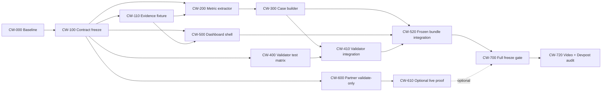

# CorpWatch MVP — Break Task Structure

> **Task-board update 2026-07-12:** Preserve completed frozen-bundle tasks, then execute the new OpenAI chat/collector/Langfuse/dashboard tasks in [`corpwatch-openai-chat-implementation-plan.md`](./corpwatch-openai-chat-implementation-plan.md). Bedrock AgentCore is no longer the target agent runtime.

> **Execution document:** Dùng file này làm task board triển khai. Product specification và các invariant đầy đủ nằm tại [`corpwatch-ultimate-agent-build-guide.md`](./corpwatch-ultimate-agent-build-guide.md).
>
> **Required skills:** Agent thực thi phải dùng `superpowers:test-driven-development` cho mọi feature/bugfix. Dùng `superpowers:systematic-debugging` khi gặp lỗi ngoài dự kiến. Tech lead dùng `superpowers:requesting-code-review` trước integration freeze.

**Mục tiêu:** Trong 1 ngày, 6 người hoàn thiện một MVP chạy local/offline, có case Bed Bath & Beyond được đóng băng, metric extraction có provenance, bundle validator fail-closed, Executive Dashboard và video demo 3 phút.

**Critical path:** `Baseline → Evidence freeze → Metric extraction → Case builder → Public validator → Dashboard integration → Freeze`.

---

## 1. Quy ước task

### 1.1 Priority

| Priority | Ý nghĩa |
|---|---|
| `P0` | Bắt buộc để MVP được xem là hoàn thành |
| `P1` | Tăng chất lượng demo nhưng có thể cắt nếu trễ |
| `P2` | Partner proof hoặc polish; không được làm ảnh hưởng critical path |

### 1.2 Trạng thái

```text
READY → IN_PROGRESS → REVIEW → DONE
                    ↘ BLOCKED
```

Một task chỉ được chuyển sang `DONE` khi:

1. Acceptance criteria đều đạt.
2. Test được chỉ định đã chạy và pass.
3. Không stage file ngoài ownership của task.
4. Reviewer khác người implement đã xem diff đối với task `P0`.

### 1.3 Báo cáo task

Mỗi agent trả receipt theo format:

```text
TASK: CW-xxx
STATUS: DONE | BLOCKED
FILES: exact paths
TESTS: command + pass/fail count
RISKS: none hoặc mô tả ngắn
HANDOFF: input/output cho task kế tiếp
```

---

## 2. Dependency graph



### Các lane có thể chạy song song

- Sau `CW-100`, Person 2 chuẩn bị evidence, Person 4 viết validator negative tests, Person 5 dựng dashboard shell và Person 6 kiểm tra partner adapters.
- `CW-300` không bắt đầu trước khi `CW-200` hoàn tất.
- Dashboard có thể dùng typed fixture trong lúc chờ bundle, nhưng `CW-520` phải dùng bundle thật.
- Live API chỉ được chạy sau khi critical path không còn blocker.

---

## 3. Phân công 6 người

| Person | Vai trò | Task chính | File ownership chính |
|---|---|---|---|
| P1 | Tech lead/integrator | CW-000, CW-100, CW-700, CW-710 | contracts, package scripts, integration |
| P2 | Evidence/data | CW-110, CW-120, CW-730 | fixtures, source registry, claim audit |
| P3 | Deterministic pipeline | CW-200–CW-320 | metric extractor, case builder |
| P4 | Validation/security | CW-400–CW-430 | public-bundle validator, negative tests |
| P5 | Frontend/demo | CW-500–CW-550, CW-720 | application UI, accessibility, video runbook |
| P6 | AI/partner/submission | CW-600–CW-630, CW-740 | OpenAI/TinyFish receipts, partner wording |

Nếu một người hoàn thành sớm, ưu tiên review task `P0`; không tự thêm feature.

---

## 4. Milestones trong 10 giờ

| Deadline | Milestone | Gate |
|---:|---|---|
| H+0:30 | Baseline established | CW-000 |
| H+1:00 | Contracts và evidence shape frozen | CW-100 |
| H+2:30 | Metric extractor GREEN | CW-200–CW-220 |
| H+4:30 | Frozen case JSON generated | CW-300–CW-320 |
| H+5:30 | Public validator GREEN | CW-400–CW-430 |
| H+7:00 | Dashboard integrated | CW-500–CW-540 |
| H+8:00 | Full freeze gate passes | CW-700 |
| H+9:00 | Video rehearsal và claims audit | CW-720–CW-740 |
| H+10:00 | Submission freeze | Không thêm feature |

---

# 5. Detailed Task Breakdown

## Epic A — Baseline và contract freeze

### CW-000 — Verify repository baseline

| Field | Value |
|---|---|
| Priority | P0 |
| Owner | P1 |
| Estimate | 30 phút |
| Depends on | None |
| Blocks | Tất cả task code |

**Files:**

- Inspect `package.json`
- Inspect `src/contracts/`
- Inspect `.gitignore`
- Không sửa production code

**Steps:**

- [ ] Chạy `uname -s`, `node --version`, `npm --version`.
- [ ] Chạy `npm test`.
- [ ] Chạy `npm run typecheck`.
- [ ] Chạy `npm run build`.
- [ ] Chạy `git check-ignore .env.local`.
- [ ] Ghi lại script names và lỗi baseline nếu có.

**Acceptance:**

- Baseline commands có kết quả cụ thể.
- `.env.local` được Git ignore.
- Không reset/clean worktree.
- Nếu baseline fail, failure được phân loại là pre-existing hoặc newly introduced trước khi task khác sửa code.

**Handoff:** Danh sách command hợp lệ và trạng thái baseline cho cả team.

---

### CW-100 — Freeze canonical contracts

| Field | Value |
|---|---|
| Priority | P0 |
| Owner | P1 |
| Estimate | 30 phút |
| Depends on | CW-000 |
| Blocks | CW-110, CW-200, CW-400, CW-500, CW-600 |

**Files:**

- Inspect `src/contracts/`
- Inspect `src/report/build-metric-lens.ts`
- Inspect `src/analysis/analysis-schema.ts`

**Steps:**

- [ ] Xác nhận tên exact của `CasePackage`, evidence, source, metric observation và readiness types.
- [ ] Xác nhận schema validator tương ứng.
- [ ] Xác nhận enum/status cho `REPORTED`, `BLOCKED_BY_MISSING_METRICS` và decision sections.
- [ ] Viết contract note ngắn vào task receipt; không tạo type song song.
- [ ] Chỉ sửa contract nếu có requirement P0 không thể biểu diễn; mọi sửa đổi cần tech-lead approval.

**Acceptance:**

- Team nhận được exact interface names.
- Không có duplicate metric/evidence/case type.
- `npm run typecheck` pass nếu contract bị sửa.

**Handoff:** Contract map cho P2–P6.

---

## Epic B — Evidence và metric data

### CW-110 — Freeze rights-safe evidence fixture

| Field | Value |
|---|---|
| Priority | P0 |
| Owner | P2 |
| Estimate | 60 phút |
| Depends on | CW-100 |
| Blocks | CW-200, CW-300, CW-520 |

**Files:**

- Use existing fixture convention after inspection
- Create only if no equivalent exists: `tests/fixtures/metric-text.ts`
- Modify approved case/source fixture under its existing path

**Steps:**

- [ ] Chọn các excerpt ngắn đủ cho required metric dictionary.
- [ ] Gán `sourceId`, `evidenceId`, URL/domain, title, published/publicly-available timestamp và rights status.
- [ ] Tách known outcome khỏi pre-outcome evidence.
- [ ] Bảo đảm Northstar Home Retail luôn được mô tả là fictional.
- [ ] Không đưa toàn bộ raw page vào fixture/public assets.
- [ ] Chạy schema validation hiện có cho fixture.

**Acceptance:**

- Mọi evidence ID unique và resolve tới source registry.
- `publicly_available_at` có giá trị cụ thể.
- Required metric parser có ít nhất một positive fixture cho mỗi metric bắt buộc hoặc missing-data case được ghi rõ.
- Không có secret/proprietary/raw-page leakage.

**Handoff:** Approved fixture path và ID list cho P3/P5.

---

### CW-120 — Evidence coverage matrix

| Field | Value |
|---|---|
| Priority | P1 |
| Owner | P2 |
| Estimate | 30 phút |
| Depends on | CW-110 |
| Blocks | CW-730 |

**Deliverable:** Một bảng nội bộ mapping:

```text
metric key → evidence ID → reporting period → unit → direct/derived → public-safe
```

**Acceptance:**

- Mọi required metric được đánh dấu `AVAILABLE` hoặc `MISSING`.
- Không có ô trạng thái mơ hồ.
- Employee count được đánh dấu optional.

---

### CW-200 — RED tests for metric extraction

| Field | Value |
|---|---|
| Priority | P0 |
| Owner | P3 |
| Estimate | 30 phút |
| Depends on | CW-100, CW-110 |
| Blocks | CW-210 |

**Files:**

- Create `tests/metrics/extract-metric-observations.test.ts`
- Use `tests/fixtures/metric-text.ts` if present

**Required tests:**

- [ ] Extract every supported metric alias.
- [ ] Convert `$7.1 billion` to `7100 USD_MILLIONS`.
- [ ] Preserve `953 stores` as `953 COUNT`.
- [ ] Preserve `sourceId` and `evidenceId`.
- [ ] Reject unknown source/evidence IDs.
- [ ] Reject ambiguous financial values.
- [ ] Reject or explicitly classify unknown periods.
- [ ] Prevent full-text leakage in returned observations.
- [ ] Treat employee count as optional.

**RED command:**

```bash
npx vitest run tests/metrics/extract-metric-observations.test.ts
```

**Acceptance:** Test fails for the expected missing module/export, not because the fixture or test syntax is broken.

---

### CW-210 — GREEN deterministic metric extractor

| Field | Value |
|---|---|
| Priority | P0 |
| Owner | P3 |
| Estimate | 60 phút |
| Depends on | CW-200 |
| Blocks | CW-220 |

**Files:**

- Create `src/metrics/extract-metric-observations.ts`

**Implementation constraints:**

- Frozen alias dictionary.
- Bounded sentence/window matching.
- Explicit currency and scale parsing.
- Billion-to-million normalization.
- Existing schema validation before return.
- No LLM numeric extraction.
- No new competing observation type.

**GREEN command:**

```bash
npx vitest run tests/metrics/extract-metric-observations.test.ts
```

**Acceptance:** Focused suite passes; implementation contains no provider/network dependency.

---

### CW-220 — Integrate extractor with metric lens

| Field | Value |
|---|---|
| Priority | P0 |
| Owner | P3 |
| Estimate | 30 phút |
| Depends on | CW-210 |
| Blocks | CW-300 |

**Files:**

- Modify focused pipeline composition only if required
- Modify `tests/report/build-metric-lens.test.ts` only for new integration coverage

**Tests:**

```bash
npx vitest run tests/metrics/extract-metric-observations.test.ts tests/report/build-metric-lens.test.ts
npm run typecheck
```

**Acceptance:**

- Extracted observations feed the existing metric lens.
- Missing required metrics create the correct blocker.
- Employee count absence does not block required readiness.

---

## Epic C — Frozen case builder

### CW-300 — RED tests for deterministic case build

| Field | Value |
|---|---|
| Priority | P0 |
| Owner | P3 |
| Estimate | 30 phút |
| Depends on | CW-220 |
| Blocks | CW-310 |

**Files:**

- Create `tests/scripts/build-case.test.ts`
- Inspect `scripts/build-case.ts`

**Required assertions:**

- [ ] Same input produces deep-equal output twice.
- [ ] Output validates as canonical `CasePackage`.
- [ ] Every evidence/metric reference resolves.
- [ ] Future evidence is absent from earlier replay frames.
- [ ] Metric lens/readiness exists.
- [ ] Output excludes secrets and raw pages.

**RED command:**

```bash
npx vitest run tests/scripts/build-case.test.ts
```

**Acceptance:** Expected failure demonstrates the current incomplete builder behavior.

---

### CW-310 — Implement pure case builder

| Field | Value |
|---|---|
| Priority | P0 |
| Owner | P3 |
| Estimate | 60 phút |
| Depends on | CW-300 |
| Blocks | CW-320 |

**Files:**

- Modify `scripts/build-case.ts`

**Pipeline:**

```text
approved fixture
→ time visibility
→ signals/replay
→ metric observations
→ metric readiness
→ validated analysis/review agenda
→ CasePackage schema
→ stable serialization
```

**Acceptance:**

- Importing builder in tests causes no filesystem write.
- CLI entrypoint writes only the intended public bundle.
- Volatile timestamps do not break determinism.
- Timeline order uses timestamp plus stable tie-breaker.

---

### CW-320 — Generate frozen public case

| Field | Value |
|---|---|
| Priority | P0 |
| Owner | P3 |
| Estimate | 30 phút |
| Depends on | CW-310 |
| Blocks | CW-410, CW-520 |

**Files:**

- Generate `public/demo/case-package.json`

**Commands:**

```bash
npm run build:case
npx vitest run tests/scripts/build-case.test.ts
npm run typecheck
```

**Acceptance:** Generated file exists, validates, and repeated generation produces no semantic diff.

---

## Epic D — Public bundle validation

### CW-400 — RED security and semantic validator matrix

| Field | Value |
|---|---|
| Priority | P0 |
| Owner | P4 |
| Estimate | 45 phút |
| Depends on | CW-100 |
| Blocks | CW-410 |

**Files:**

- Create `tests/scripts/validate-public-bundle.test.ts`
- Inspect `scripts/validate-public-bundle.ts`

**Invalid fixtures:**

- [ ] Secret/key-like content.
- [ ] Authorization header.
- [ ] Excessively long raw text.
- [ ] Unknown evidence/source ID.
- [ ] Future evidence in replay.
- [ ] Unsupported factual claim.
- [ ] False `READY` with missing required metric.
- [ ] Unsafe URL scheme or unapproved rights status.

**RED command:**

```bash
npx vitest run tests/scripts/validate-public-bundle.test.ts
```

**Acceptance:** Each negative fixture is independently named and expected to fail closed.

---

### CW-410 — Implement public-bundle validator

| Field | Value |
|---|---|
| Priority | P0 |
| Owner | P4 |
| Estimate | 60 phút |
| Depends on | CW-320, CW-400 |
| Blocks | CW-420, CW-520 |

**Files:**

- Modify `scripts/validate-public-bundle.ts`

**Implementation order:**

1. Parse JSON safely.
2. Validate canonical schema.
3. Validate references.
4. Validate temporal integrity.
5. Validate claim provenance.
6. Validate metric readiness.
7. Scan for secret/raw-content leakage.
8. Return stable issue codes without echoing sensitive values.

**Acceptance:** All invalid fixtures are rejected and the generated bundle passes.

---

### CW-420 — Wire validator into build

| Field | Value |
|---|---|
| Priority | P0 |
| Owner | P1 + P4 |
| Estimate | 30 phút |
| Depends on | CW-410 |
| Blocks | CW-430, CW-700 |

**Files:**

- Modify `package.json` only if script wiring requires it

**Commands:**

```bash
npm run validate:public-bundle
npm run build
```

**Acceptance:** Build exits non-zero for invalid bundle and exits `0` for the frozen valid bundle. No unfinished-script message remains.

---

### CW-430 — Validator adversarial review

| Field | Value |
|---|---|
| Priority | P1 |
| Owner | P4 reviewer + P2 evidence reviewer |
| Estimate | 30 phút |
| Depends on | CW-420 |

**Review probes:**

- Nested secret inside arrays/metadata.
- Case-insensitive authorization strings.
- Dangling claim references.
- Timezone boundary at exact `as_of` timestamp.
- Metric marked reported but lacking direct evidence.
- Long excerpt split across multiple fields.

**Acceptance:** Any discovered gap gets a failing regression test before its fix.

---

## Epic E — Executive Dashboard

### CW-500 — RED tests for judge journey

| Field | Value |
|---|---|
| Priority | P0 |
| Owner | P5 |
| Estimate | 45 phút |
| Depends on | CW-100, CW-110 |
| Blocks | CW-510 |

**Files:**

- Modify `src/app/App.test.tsx`

**Required UI assertions:**

- [ ] Watch context and as-of date.
- [ ] Evidence replay timeline.
- [ ] Strategic pattern radar.
- [ ] Metric coverage and blockers.
- [ ] `MAINTAIN`, `ADAPT`, `ACCELERATE` scenarios.
- [ ] Cost-benefit-risk comparison.
- [ ] Revenue/cash-flow/operations impact.
- [ ] Executive agenda and challenger questions.
- [ ] Working evidence navigation.
- [ ] Offline/replay label.
- [ ] Empty, blocked, and load-error states.

**RED command:**

```bash
npx vitest run src/app/App.test.tsx
```

---

### CW-510 — Build dashboard sections against typed fixture

| Field | Value |
|---|---|
| Priority | P0 |
| Owner | P5 |
| Estimate | 90 phút |
| Depends on | CW-500 |
| Blocks | CW-520 |

**Files:**

- Modify `src/app/App.tsx`
- Create focused components only under existing app conventions
- Modify existing style/token files

**Information order:**

1. Hero and current posture.
2. Strongest cited signal clusters.
3. Replay timeline.
4. Metric lens.
5. Three scenarios.
6. Cost-benefit-risk and impact.
7. Executive agenda/challenger.
8. Evidence and limitations.

**Acceptance:**

- No chart implies unsupported precision.
- Status never depends on color alone.
- Keyboard focus is visible.
- Narrow viewport becomes single column.
- Blocked state explains missing metrics.

---

### CW-520 — Integrate real frozen bundle

| Field | Value |
|---|---|
| Priority | P0 |
| Owner | P5 + P3 |
| Estimate | 45 phút |
| Depends on | CW-320, CW-410, CW-510 |
| Blocks | CW-530, CW-700 |

**Files:**

- Modify app data-loading code
- Consume `public/demo/case-package.json`

**Acceptance:**

- UI reads canonical validated bundle only.
- No direct provider response is consumed.
- Evidence links resolve inside the app.
- Reload works with network/API providers disabled.

---

### CW-530 — Accessibility and responsive verification

| Field | Value |
|---|---|
| Priority | P0 |
| Owner | P5 |
| Estimate | 30 phút |
| Depends on | CW-520 |

**Checks:**

- [ ] Keyboard navigation.
- [ ] Visible focus.
- [ ] Semantic headings/table structure.
- [ ] Non-color status labels.
- [ ] Approximately 360 px, 768 px, and desktop widths.
- [ ] Long evidence titles wrap without overflow.
- [ ] Bundle failure has actionable message.

**Commands:**

```bash
npx vitest run src/app/App.test.tsx
npm run typecheck
npm run build
```

---

### CW-540 — Judge-story polish

| Field | Value |
|---|---|
| Priority | P1 |
| Owner | P5 |
| Estimate | 30 phút maximum |
| Depends on | CW-530 |

**Allowed polish:** spacing, typography, section hierarchy, concise labels, screenshot-friendly viewport.

**Forbidden polish:** complex animation, new chart library, 3D visualization, provider-dependent UI, schema changes.

---

## Epic F — Optional partner proof

### CW-600 — Validate existing partner adapters without paid calls

| Field | Value |
|---|---|
| Priority | P1 |
| Owner | P6 |
| Estimate | 30 phút |
| Depends on | CW-100 |
| Blocks | CW-610 |

**Files:**

- Inspect `src/partners/openai.ts`
- Inspect `src/partners/tinyfish.ts`
- Inspect `scripts/preflight-openai.ts`

**Commands:**

```bash
npx vitest run tests/partners/openai.test.ts tests/partners/tinyfish.test.ts
set -a
source .env.local
set +a
PARTNER_EXECUTION_MODE=validate npm run preflight:openai
```

**Acceptance:** Adapter tests and validate-only path pass without paid network use. Do not refactor green code during the hackathon.

---

### CW-610 — Add bounded TinyFish preflight if absent

| Field | Value |
|---|---|
| Priority | P2 |
| Owner | P6 |
| Estimate | 45 phút maximum |
| Depends on | CW-600 |
| Blocks | CW-620 only |

**Files:**

- Create `scripts/preflight-tinyfish.ts` only if absent
- Create `tests/partners/tinyfish-preflight.test.ts`
- Modify `package.json` for focused script

**Acceptance:** Validate-only mode, bounded URL count, sanitized output, graceful provider errors. Cut task if any P0 milestone is late.

---

### CW-620 — One approved live proof

| Field | Value |
|---|---|
| Priority | P2 |
| Owner | P6 |
| Estimate | 30 phút maximum |
| Depends on | CW-610 and available keys |
| Blocks | None |

**Guardrails:**

- Explicit `PARTNER_EXECUTION_MODE=live`.
- OpenAI approval JSON valid and maximum cost no more than USD 6.
- TinyFish tools explicitly enabled.
- One bounded query and minimal fetch.
- Stop after success or a clearly diagnosed provider/config failure.

**Acceptance:** Sanitized receipt exists, or task closes as optional failure without affecting MVP.

---

### CW-630 — Partner claims ledger

| Field | Value |
|---|---|
| Priority | P0 for submission honesty |
| Owner | P6 |
| Estimate | 30 phút |
| Depends on | CW-600; CW-620 optional |

**Files:**

- Create `docs/demo/corpwatch-submission-claims.md`

**Statuses:**

- `DEMONSTRATED`
- `TESTED`
- `LIVE_RECEIPT`
- `OMIT`

**Acceptance:** Apify, AWS, ClickHouse, Langfuse, TinyFish và OpenAI đều có status riêng. Chỉ partner có material live receipt mới được claim là đã sử dụng.

---

## Epic G — Integration, freeze và submission

### CW-700 — Full technical freeze gate

| Field | Value |
|---|---|
| Priority | P0 |
| Owner | P1 |
| Estimate | 30 phút |
| Depends on | CW-420, CW-520, CW-530 |
| Blocks | CW-710, CW-720, CW-740 |

**Commands:**

```bash
npm test
npm run typecheck
npm run build
npm run validate:public-bundle
```

**Acceptance:**

- All commands exit `0`.
- No unfinished-script output.
- Frozen bundle is deterministic.
- App works with provider keys unavailable.
- Test/build receipt records exact counts.

---

### CW-710 — Independent strict review

| Field | Value |
|---|---|
| Priority | P0 |
| Owner | Reviewer khác P1/P3/P4/P5 implementation owner |
| Estimate | 30 phút |
| Depends on | CW-700 |

**Review order:**

1. Temporal leakage.
2. Unsupported claims.
3. False readiness.
4. Secret/raw-content leakage.
5. Broken evidence navigation.
6. Offline failure.
7. Misleading business language.

**Acceptance:** Mọi P0 finding được fix bằng regression test; P1/P2 finding được ghi vào known limitations nếu không sửa.

---

### CW-720 — Demo runbook và video rehearsal

| Field | Value |
|---|---|
| Priority | P0 |
| Owner | P5 |
| Estimate | 45 phút |
| Depends on | CW-700 |

**Files:**

- Create `docs/demo/corpwatch-demo-runbook.md`

**3-minute sequence:**

```text
0:00–0:20  Problem
0:20–0:40  Company + as-of selection
0:40–1:15  Evidence replay
1:15–1:45  Metric lens and blockers
1:45–2:20  MAINTAIN / ADAPT / ACCELERATE
2:20–2:40  Recommendation + challenger
2:40–2:55  Citation + deterministic validation
2:55–3:00  Closing tagline
```

**Acceptance:** Runbook hoàn thành dưới 3 phút trong hai lần rehearsal liên tiếp và không cần live API.

---

### CW-730 — Business/evidence truth audit

| Field | Value |
|---|---|
| Priority | P0 |
| Owner | P2 |
| Estimate | 30 phút |
| Depends on | CW-120, CW-700 |

**Checks:**

- [ ] Bed Bath & Beyond facts link to approved evidence.
- [ ] Northstar is clearly fictional.
- [ ] Units and periods are visible.
- [ ] Known outcome does not leak into earlier replay.
- [ ] Scenario language is decision support, not prediction certainty.
- [ ] Missing metrics remain visible.

---

### CW-740 — Devpost proposal freeze

| Field | Value |
|---|---|
| Priority | P0 |
| Owner | P6 + P1 approval |
| Estimate | 45 phút |
| Depends on | CW-630, CW-700, CW-730 |

**Files:**

- Modify `docs/proposal/corpwatch-judge-ready-master-proposal.md`

**Acceptance:**

- Future tense converted to past tense only for demonstrated/tested capabilities.
- Partner selections match `LIVE_RECEIPT` evidence.
- No AWS Bedrock claim unless it was actually used.
- Proposal, dashboard, and video describe the same product direction.
- Submission text names limitations honestly.

---

## 6. Integration rules

### File collision prevention

- P3 owns metric extractor and case builder.
- P4 owns validator files.
- P5 owns UI files.
- P6 owns preflight/claims docs.
- `package.json`, shared contracts, and public bundle require P1 coordination.

### Commit rules

- Một commit cho mỗi task có deliverable độc lập.
- Không dùng `git add .`.
- Không commit `.env.local`, raw receipts, raw fetched pages hoặc unrelated files.
- Không rebase/reset/clean nếu chưa có user approval.
- Suggested messages:

```text
feat: extract cited strategic metrics
feat: build deterministic demo case
feat: enforce public bundle safety
feat: deliver executive change radar dashboard
test: cover TinyFish preflight bounds
docs: freeze CorpWatch demo and claims
```

---

## 7. Stop/go rules

### GO live partner work only when

- P0 tests are green.
- Frozen bundle exists.
- Public validator passes.
- Dashboard runs offline.
- API key and explicit live approval are present.

### STOP optional work when

- Case builder chưa green tại H+4:30.
- Validator chưa green tại H+5:30.
- Dashboard integration chưa hoàn thành tại H+7:00.
- Spending gần USD 6.
- Provider error đã được chẩn đoán rõ và retry không tạo thêm giá trị.

### Cut order

1. Animation/decorative charts.
2. Additional companies/sources.
3. OpenAI live tool loop.
4. TinyFish live preflight.
5. Optional employee metric.

Không cắt evidence provenance, temporal integrity, readiness blockers, bundle validation, offline mode hoặc video rehearsal.

---

## 8. Final MVP checklist

- [ ] CW-000 Baseline verified.
- [ ] CW-100 Contracts frozen.
- [ ] CW-110 Evidence fixture approved.
- [ ] CW-200–220 Metric extraction GREEN.
- [ ] CW-300–320 Frozen case generated deterministically.
- [ ] CW-400–430 Public validator fails closed.
- [ ] CW-500–530 Dashboard works offline and responsively.
- [ ] CW-630 Partner claims ledger completed.
- [ ] CW-700 Full technical gate passed.
- [ ] CW-710 Independent strict review passed.
- [ ] CW-720 Demo rehearsed twice under time limit.
- [ ] CW-730 Business/evidence audit passed.
- [ ] CW-740 Devpost proposal frozen.

Project chỉ được gọi là **MVP READY** khi toàn bộ task `P0` phía trên có receipt hiện tại. Optional live partner failure không làm MVP thất bại; provenance, bundle safety hoặc offline dashboard failure thì có.
